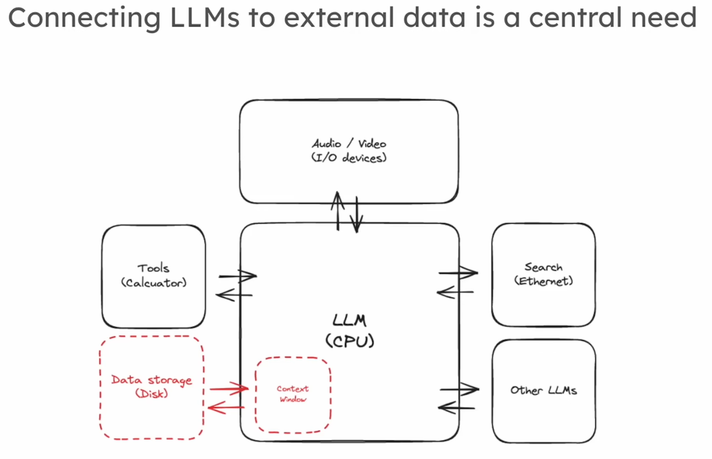
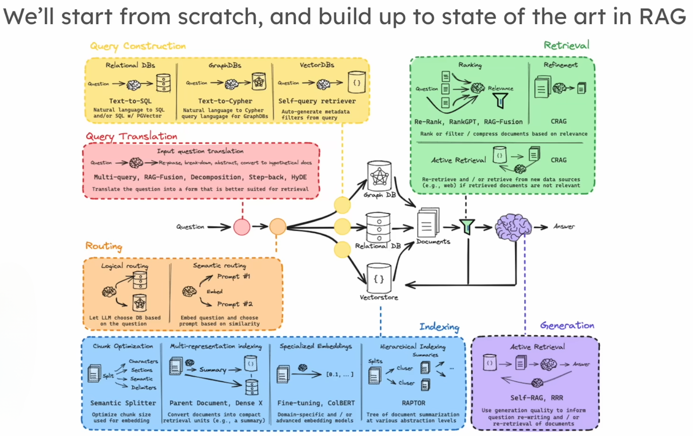

# 🧠 Understanding RAG (Retrieval Augmented Generation) and Its Role with LLMs

## 📌 General Context: Why Feed External Data into LLMs?

**LLMs (Large Language Models)** are trained on **huge amounts of publicly available data** from the internet (web pages, Wikipedia, forums, etc.).

However, these models have **never seen your private data** (internal company documents, databases, confidential reports).  
Yet, in reality, **the most valuable data is rarely public**. It often exists within **internal systems of companies, administrations, or organizations.**

### 🔑 Why Feed LLMs with Private Data?
Think of an LLM as **a brilliant student who read the entire encyclopedia but never opened your company's internal documents**.  
To answer specific questions, you need to **give it access to your private library** without retraining it from scratch.

---

<!--  -->

  

---

## 🚀 What is RAG: Retrieval Augmented Generation?

**RAG** allows LLMs to **connect to external and private data sources.**  
Instead of retraining the model, we **feed it relevant information on demand from a suitable database.**

### 📂 General Analogy
1. **Index your data (Create a searchable library)**
2. **Retrieve relevant information for each question**
3. **Generate answers enriched by this retrieved information**

It's like asking a colleague a question:  
- First, they search through the company archives (indexing / retrieval)  
- Then they answer you based on what they found (generation)

---

<!--  -->

  

---

## 🛠️ The 3 Core Components of RAG

### 1️⃣ **Indexing**  
Creating a **searchable database**: SQL, GraphDB, Vector Store…  
Transform documents so they can be **easily retrieved through intelligent searches.**

### 2️⃣ **Retrieval**  
From a user query, **retrieve relevant documents**.  
These documents enrich the LLM's ability to provide grounded answers.

### 3️⃣ **Generation**  
The LLM **uses retrieved documents** to produce clear, contextualized, and reliable answers.

---

## 🧑‍💼 Why Is This Useful?
RAG connects the **general intelligence of LLMs to structured private organizational knowledge.**  
It bridges:
- **The encyclopedia (LLM)**
- **Your internal library (Private database)**

---

<!--  -->

  

---

# 🔍 Deep Dive: From Simple Retrieval to Advanced RAG

Here’s a detailed overview of **advanced techniques** to improve RAG systems.

<!--  -->

  

## 📊 Detailed Breakdown of the Steps

### 1️⃣ **Query Transformation**
Refine the initial question to make it **better suited for retrieval**:
- **Rewriting** for clarity
- **Decomposing** into more precise sub-questions

### 2️⃣ **Routing**
Direct the query **to the right source**:
- Multiple databases? SQL, VectorStore, GraphDB… Properly route the query.

### 3️⃣ **Query Construction**
Convert queries into the appropriate language for each database:  
Examples:  
- **Text-to-SQL**  
- **Text-to-Cypher (Graph DB)**  
- **Text-to-filters for VectorStore**

### 4️⃣ **Indexing (Advanced)**
Prepare documents for **optimal retrieval**:
- **Embedding methods**
- **Indexing strategies tailored to needs**

### 5️⃣ **Retrieval**
Techniques to:
- Filter, rerank retrieved documents
- Prioritize relevance

### 6️⃣ **Generation (Advanced RAG)**
Techniques to:
- **Assess retrieved document quality**
- **Assess answer faithfulness (hallucination mitigation)**
- Apply feedback loops when answers are unsatisfactory (rewrite query, re-retrieve, regenerate)

---

## 📥 Summary: RAG in Simple Steps
| Step             | Purpose                                     | Example Tools            |
|------------------|---------------------------------------------|---------------------------|
| **Indexing**     | Organize information                         | VectorStore, SQL, GraphDB  |
| **Retrieval**    | Retrieve relevant documents                   | Similarity Search, Reranking |
| **Generation**   | Produce enriched and reliable answers          | LLM with prompt + context  |
| **Feedback**     | Verify quality, iterate if necessary           | Faithfulness/Relevance Checks |

---

## 🔭 Objective: From Simple to Advanced
We will start with **fundamental RAG concepts** and gradually move towards more advanced techniques.

### 🛤️ Learning Path
1️⃣ Understand indexing  
2️⃣ Master retrieval  
3️⃣ Optimize generation  
4️⃣ Explore transformation, routing, and answer faithfulness

---

# 📚 Conclusion
**RAG is a powerful technology** because it unites:
- **The intelligence of LLMs** (reasoning, language generation)
- **Private structured knowledge** (internal databases, confidential documents)

It is a **key enabler** to make AI truly useful and applicable to real-world enterprise challenges.
