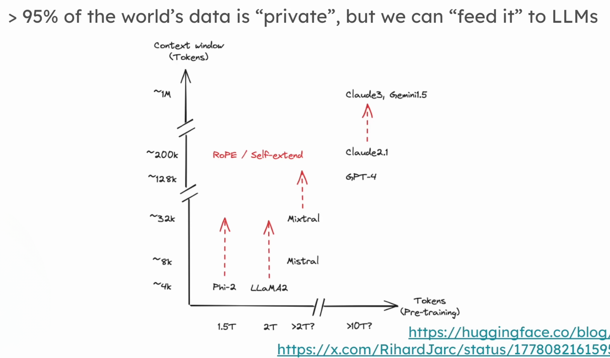
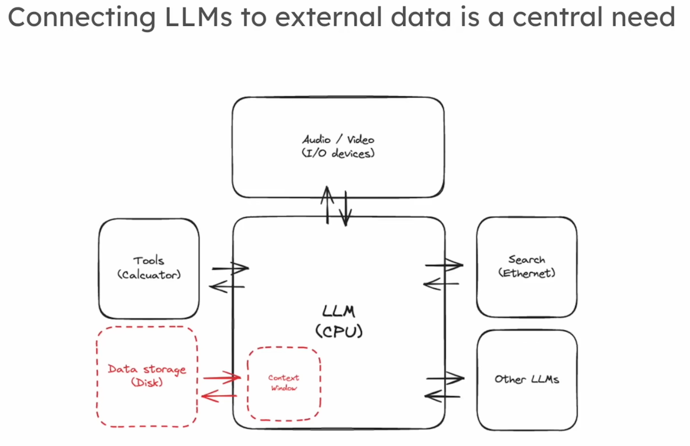
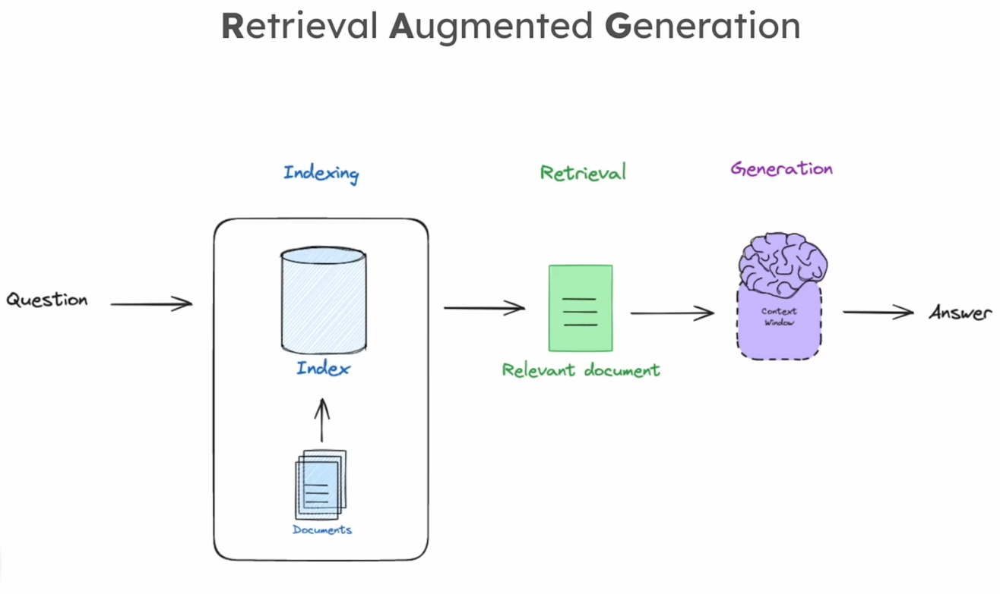
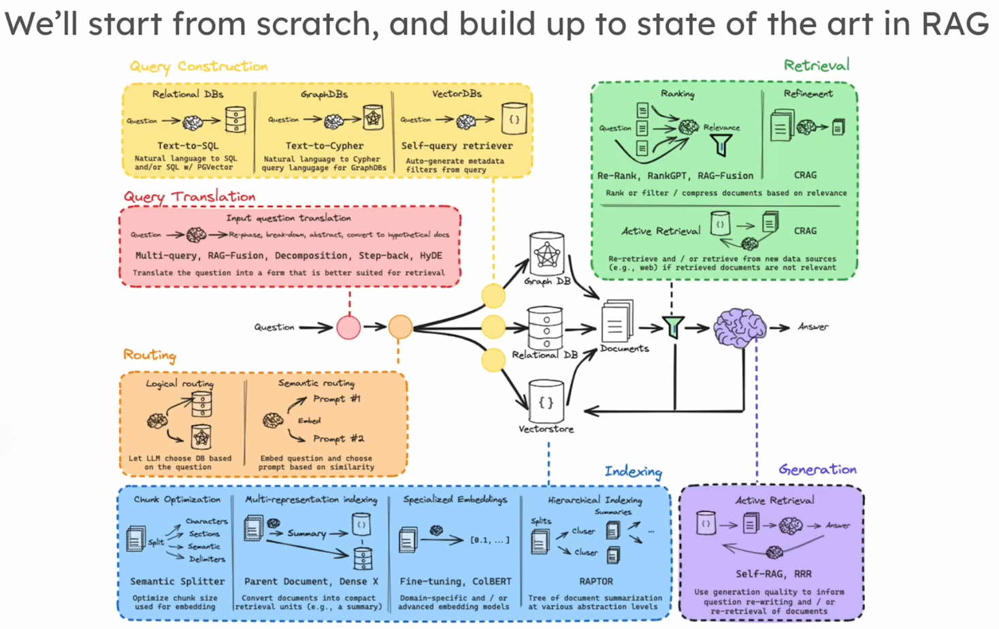

# 🧠 Comprendre le RAG (Retrieval Augmented Generation) et son rôle avec les LLMs

## 📌 Contexte Général : Pourquoi intégrer des données externes aux LLMs ?

Les **LLMs (Large Language Models)** sont des modèles d’intelligence artificielle qui sont **entraînés sur d’immenses volumes de données publiques accessibles sur Internet** (pages web, articles Wikipédia, forums, etc.).

Cependant, ces modèles n’ont **jamais eu accès à vos données privées** (documents internes, bases de données, rapports confidentiels).  
Or, dans le monde réel, **l’information la plus précieuse n’est pas publique**. Elle réside dans les **systèmes d’information internes aux entreprises, administrations, ou organisations.**

### 🔑 Pourquoi nourrir les LLMs avec des données privées ?
Imaginez un LLM comme **un étudiant brillant qui a lu toute l’encyclopédie, mais jamais vos cours ou vos dossiers d’entreprise**.  
Pour répondre à vos questions spécifiques, il est essentiel de **lui donner accès à votre bibliothèque privée**, sans qu’il ait besoin de tout réapprendre.

---

<!--  -->

  

---

## 🚀 Le RAG : Retrieval Augmented Generation

Le **RAG** (ou génération augmentée par récupération) permet de **connecter un LLM à des sources de données externes et privées.**  
Plutôt que d’entraîner à nouveau le modèle, on va **lui fournir, à la volée, les bonnes informations depuis une base de données pertinente.**

### 📂 Schéma Général (Analogie simple)
1. **Indexer vos données (Créer une bibliothèque consultable)**
2. **Chercher la bonne information à chaque question**
3. **Générer une réponse enrichie par ces informations retrouvées**

C’est comme si vous posiez une question à un collègue :  
- D’abord il cherche dans l’archive de l’entreprise (indexation / récupération)  
- Puis il vous répond en s’appuyant sur ce qu’il a trouvé (génération)

---

<!--  -->

  

---

## 🛠️ Les 3 piliers fondamentaux du RAG

### 1️⃣ **Indexation**  
Créer une **base consultable** : SQL, GraphDB, Vector Store…  
Transformer les documents pour qu’ils soient facilement **retrouvables via des recherches intelligentes.**

### 2️⃣ **Récupération**  
À partir d’une question, **retrouver les documents pertinents**.  
Ces documents sont choisis car ils augmentent la capacité du LLM à produire une réponse fondée.

### 3️⃣ **Génération**  
Le LLM **utilise les documents retrouvés** pour produire une réponse claire, contextualisée et fiable.

---

## 🧑‍💼 Pourquoi est-ce si utile ?
Le **RAG connecte l’intelligence générale des LLMs à la mémoire privée et structurée des organisations.**  
C’est la rencontre entre :
- **L’encyclopédie (LLM)**
- **Votre bibliothèque interne (Base de données privée)**

---

<!--  -->

  

---

# 🔍 Approfondissement : De la simple recherche à un RAG avancé

Voici une vue d’ensemble plus détaillée des **techniques avancées** utilisées pour affiner un système RAG.

<!--  -->

  

## 📊 Schéma détaillé des étapes

### 1️⃣ **Transformation des Requêtes (Query Transformation)**
Modifier la question initiale pour la rendre **plus efficace pour la recherche** :
- **Réécriture** pour clarifier l’intention
- **Décomposition** en sous-questions plus précises

### 2️⃣ **Routage**
Acheminer la requête **vers la bonne source** :
- Plusieurs bases ? SQL, VectorStore, GraphDB… Il faut orienter correctement la question.

### 3️⃣ **Construction de Requêtes**
Transformer la requête en langage compatible avec la base ciblée :  
Exemples :  
- **Texte vers SQL**  
- **Texte vers Cypher (Graph DB)**  
- **Texte vers filtres pour VectorStore**

### 4️⃣ **Indexation (Approfondie)**
Préparer les documents pour **faciliter leur recherche** :
- Méthodes d’**embedding (plongement sémantique)**
- Stratégies d’**indexation adaptées au besoin**

### 5️⃣ **Récupération (Retrieval)**
Techniques pour :
- Filtrer, reranker les documents retrouvés
- Prioriser la pertinence

### 6️⃣ **Génération (Advanced RAG)**
Méthodes pour :
- **Évaluer la qualité des documents récupérés**
- **Évaluer la fidélité des réponses (anti-hallucination)**
- Appliquer des boucles de feedback si la réponse n’est pas satisfaisante (retravailler la question, relancer la recherche, régénérer)

---

## 📥 Synthèse : Le RAG en étapes simples
| Étape             | Fonction                                  | Outil / Exemple              |
|-------------------|-------------------------------------------|-------------------------------|
| **Indexation**    | Organiser l’information                    | VectorStore, SQL, GraphDB      |
| **Récupération**  | Retrouver les documents utiles              | Similarity Search, Reranking   |
| **Génération**    | Produire une réponse enrichie et fiable      | LLM avec prompt + context      |
| **Feedback**      | Vérifier la qualité, itérer si besoin        | Vérification fidélité / pertinence |

---

## 🔭 Objectif : Du simple au complexe
Nous partirons des **bases fondamentales du RAG** pour progressivement intégrer des techniques plus avancées.

### 🛤️ Chemin d’apprentissage
1️⃣ Comprendre l’indexation  
2️⃣ Maîtriser la récupération  
3️⃣ Optimiser la génération  
4️⃣ Explorer la transformation, le routage et la fidélité des réponses

---

# 📚 Conclusion
Le **RAG est une technologie puissante** car elle unit :
- **L’intelligence des LLMs** (raisonnement, rédaction)
- **Les connaissances privées structurées** (bases internes, documents confidentiels)

C’est une des clés majeures pour rendre l’IA vraiment utile et applicable aux contextes métier réels.
