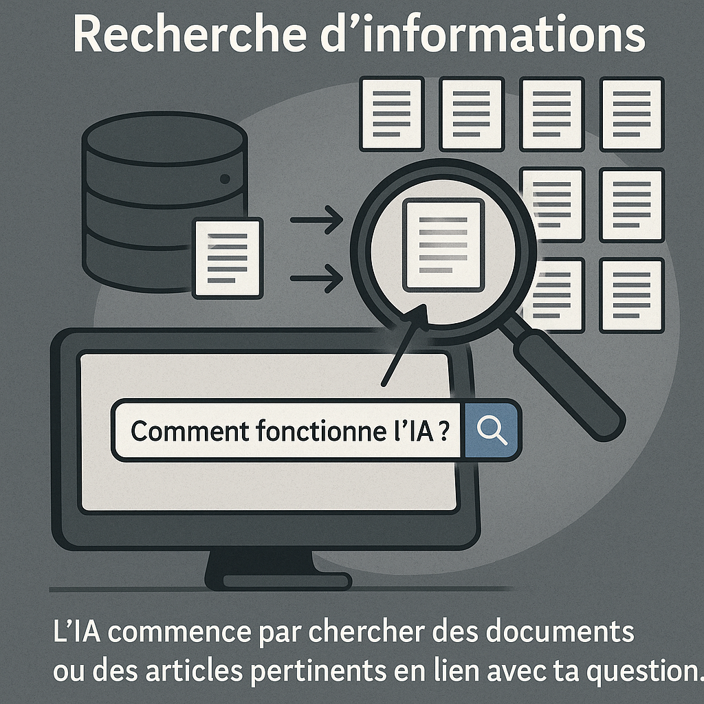
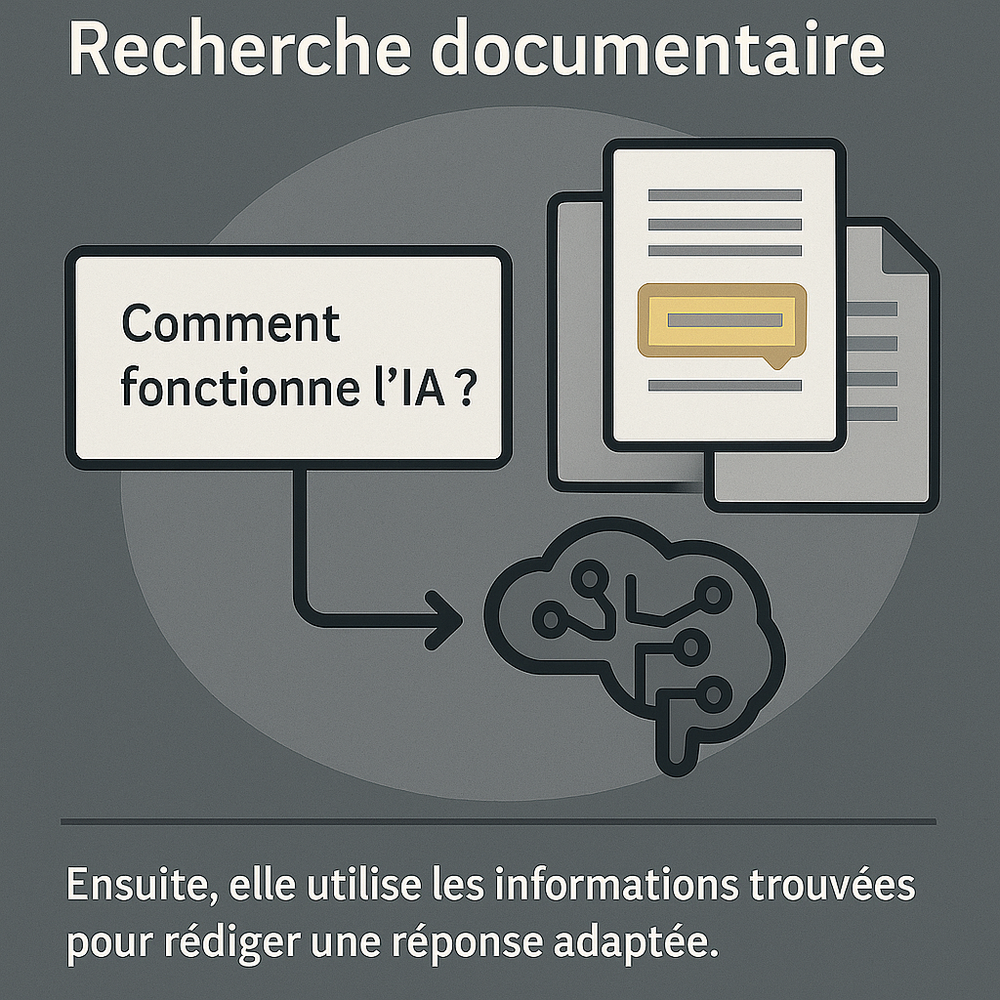
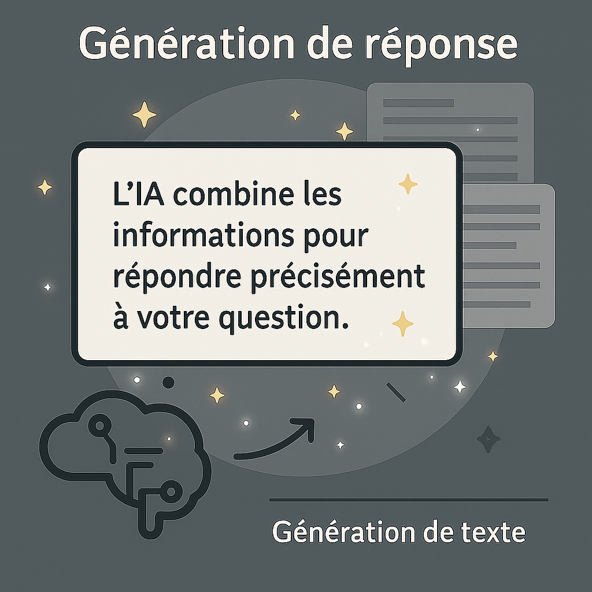
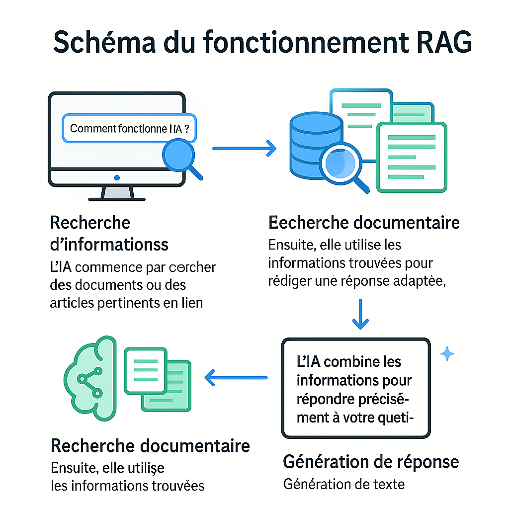

# Comprendre le RAG (Retrieval-Augmented Generation) : L’IA qui va chercher l’info pour mieux répondre

---

## Définition mot à mot de RAG

- **Retrieval** (Recherche) : L’action de retrouver ou d’aller chercher des informations pertinentes dans une base de données, des documents ou sur internet.
- **Augmented** (Augmenté) : Cela signifie que la génération de texte est enrichie ou améliorée par les informations récupérées.
- **Generation** (Génération) : La capacité de l’IA à produire du texte ou des réponses à partir des informations qu’elle possède ou qu’elle a récupérées.

**Relation entre les termes** :  
La génération (Generation) est augmentée (Augmented) grâce à la recherche (Retrieval) d’informations. L’IA ne se contente pas de ce qu’elle sait : elle va chercher des données à jour et les utilise pour créer une réponse plus pertinente.

---

## Qu’est-ce que le RAG ?

Le RAG est une technique d’intelligence artificielle qui combine deux grandes capacités :  
**la recherche d’informations** et **la génération de texte**.

Imagine un assistant IA qui, avant de te répondre, va d’abord chercher dans une bibliothèque ou sur internet, puis utilise ce qu’il a trouvé pour te donner une réponse précise et à jour.

---

## Comment ça marche ?

<table>
  <tr>
    <td>
      <strong>Recherche d’informations</strong> 
      L’IA commence par chercher des documents ou des articles pertinents en lien avec ta question. 
       
      

      <strong>Recherche documentaire</strong> 
      L’IA analyse et sélectionne les documents les plus utiles pour répondre. 
      
    </td>
    <td>
      <strong>Génération de réponse</strong> 
      Ensuite, elle utilise les informations trouvées pour rédiger une réponse adaptée. 
      
    </td>
  </tr>
</table>

---

## Exemple concret

> Tu demandes : « Quel est le dernier vaccin contre la grippe ? »  
> L’IA va chercher les articles récents sur les vaccins, puis te répond avec les infos les plus à jour.

---

## Pourquoi c’est utile ?

- **Des réponses plus précises et fiables**
- **Des informations à jour**
- **Une IA qui s’adapte à tes besoins**

---

## Schéma du fonctionnement RAG

  

---

## Pour aller plus loin

- [Vidéo IBM sur le RAG](https://www.youtube.com/watch?v=wd7TZ4w1mSw)
- [Explication scientifique (article)](https://arxiv.org/abs/2005.11401)

---

> Le RAG, c’est comme si ton assistant IA avait accès à une bibliothèque géante et pouvait lire les livres avant de te répondre !
